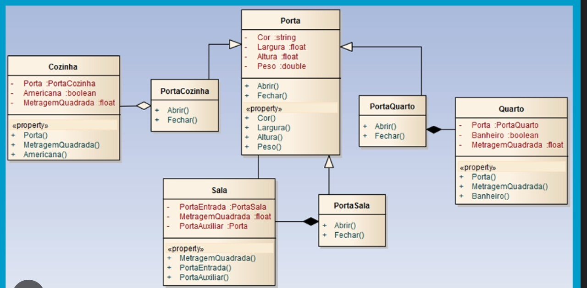
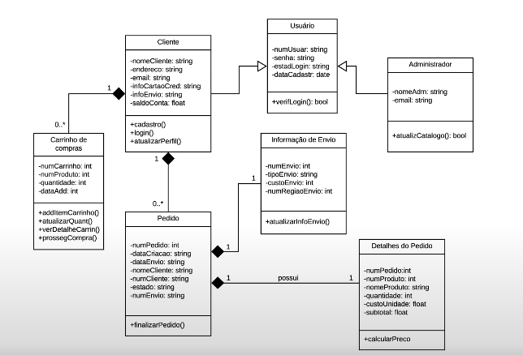

# Tutorial de Diagramas de Classes UML:

- No diagrama de classes, nós representamos as classes com esses quadrados como é descrito acima.

- Cada classe possui 3 regiões: 1°região é o nome, 2°região são os atributos, 3°região são os métodos.

- Atributo: pedaço significativo de dados que contém valores que descrevem cada instância dessa classe.

- Métodos: permitem especificar características comportamentais de uma classe.

## Visibilidade:

- Visibilidade: a visibilidade é o sinal que aparece antes dos atributos e métodos, eles definem a acessibilidade para o mesmo, e possui 4 tipos de sinais: `(-); (+); (#); (~).`

- O sinal `(-)` significa privado, ou seja, não podem ser acessados por qualquer classe ou subclasse.

- O sinal `(+)` siginifica público, ou seja, pode ser acessado por qualquer outra classe.

- O sinal `(#)` significa protegido, ou seja, pode ser acessado somente pela mesma classe ou subclasses.

- O sinal `(~)` signica pacote, ou seja, pode ser acessado por qualquer outra classe contanto que esteja no mesmo pacote.

## Relacionamentos

- Herança: representado por um segmento de reta e ceta. a reta parte da subclasse e chega na classe pai. Isso significa que a subclasse é filha da classe pai. Todas essas subclasses possuem os `MESMOS` métodos e atributos que a classe pai. E nas subclasses podemos adicionar atributos específicos. E se quisermos modificar algo em todas as subclasses, modifique a classe maior e se aplicará a tudo.

- Abstração: uma classe abstrata é uma classe que pode ser reutilizada como se fosse uma ferramenta. Para mostrar no diagrama que a classe é abstrata, podemos deixar o nome em itálico e adicionar sinais de `<>` em volta.

- Associação: representado por apenas um segmento. Usado para associar a característica de uma classe a outra e não possui nenhuma dependência entre eles. Por exemplo:

- Agregação: Representado por uma reta e um losango, é um Tipo de relacionamento que expecifica um todo e suas partes. É quando uma parte pode existir dentro ou fora do todo. Ele não é obrigado a existir em um todo. Por exemplo:

- Composição: Representado por uma reta e um losango preenchido, é um tipo de relacionamento com as mesmas características da agregação, porém ela teve ser parte de um todo, e n pode ficar de fora. Isso ocorre quando um objeto secundário não pode existir sem seu objeto primário. por exemplo:

## Multiplicidade:

- Isso permite restrições numéricas em seus relacionamentos. Existem esses tipos de multiplicidade: `0..1 zero a um (opcional); n (montante específico); 0..* zero a muitos; 1..* um a vários; m..n intervalo específico.` 

# Exemplo final:

