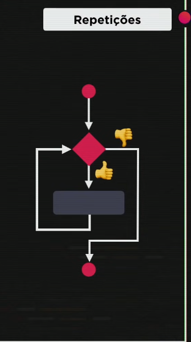
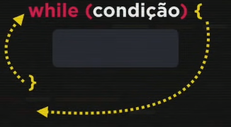
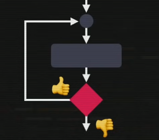

# Repetições em JS parte 1:

- Chamadas também de `laços ou iterações`.

- As repetições podem se aplicar a conceitos do cotidiano, como por exemplo, comer uma pizza. Segue um ezemplo de código com uma representação de como seria uma função comerPizza() de forma literal:

- 
 

- O exemplo acima é algo literal e repetitivo demais, porém, no JS exestem maneiras de tornar algo repetido em algo mais simples de se fazer sem muitas repetições.
 

- Na programação, partimos do ponto A, para o ponto B com códigos, assim atingimos nossos objetivos. E para conseguir atingir esses objetivos, existem várias `estruturas de controle`, como por exemplo:
 

- `Sequências(um passo depois do outro para chegar ao ponto B); Condições(testes de verdadeiro ou falso que executam tarefas específicas no código para chegar ao ponto B);`
 

- As repetições/loops são uma estrutura de controle que faz um teste lógico se a espressão é true ou false e ao invés de ir para o final, ele repete o código até um número específico de repetições.
 

- As repetições/loops possuem a seguinte representação gráfica:
 

- 
 

- Para escrever isso em JS, tem algumas maneiras, como por exemplo:
 

~~~JS exemplo
while (condição) { //o while quer dizer "enquanto esta condição for true"
    'comandos';
}
~~~
 

- Fluxo do while: 
 

- A estrutura acima é uma `estrutura de repetição com teste lógico inicial`. Pois ele faz o teste primeiro.
 

- Mas também existe essa estrutura ao contrário, como esse:
 

 

- Para escrever o fluxo acima, usamos a seguinte sintaxe:
 

~~~JS exemplo:
do{
    //bloco
} while(condição);
~~~

- Chamamos essa estrutura de `estrutura de repetição com teste lógico no final`.