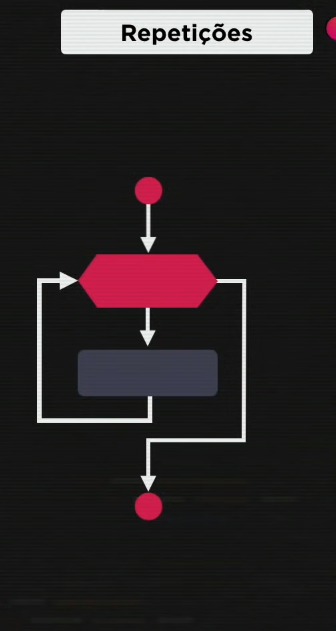

# Repetições em JS parte 2:
 

- `Estrutura de repetição com variável de controle: feitas 3 coisas entre os (): inicialização; teste lógico; incremento || decremento;`
 

- Se o teste lógico for true, ele executa o comando, faz o looping executando o incremento.
 

 

- Para escrever isso em JS, segue o exemplo:
 

~~~JS exemplo
    for(inicio;teste;incremento){
        //comandos
    }
~~~
 

- `Usar DEBUG para facilitar.`